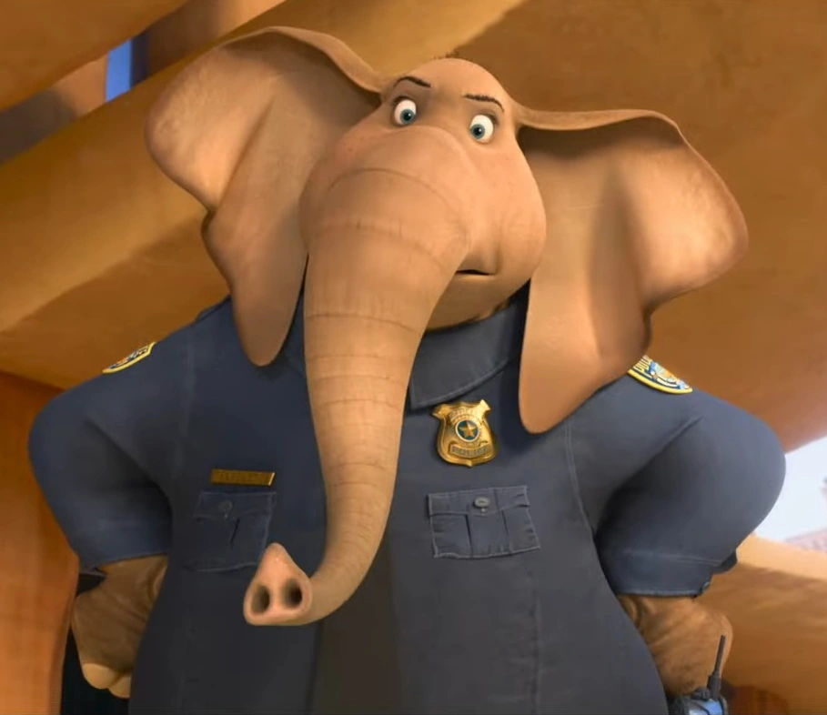

::: {.callout-note}
This is a coursework assignment for the *Introduction to Digital Humanities* course. I have now revised and polished it slightly (the original submission was rushed to meet the deadline and rather rough), and I’ve uploaded it to GitHub for everyone to study together.
:::

::: {.callout-tip}
## 📝 Abstract
- **Purpose:** This study aims to analyze **the discourse features of characters** in *Zootopia*, with a specific focus on examining these features through **a gender lens**.

- **Method:** This study involves **quantitative text analysis** and **sentiment analysis** techniques. More specifically, the Type-Token Ratio (TTR) of each character’s subtitles and the sentiment score of each character - derived at both the word-level (using the `AFINN` dictionary) and sentence-level (via the `sentimentr` package) - were computed to investigate the relationship between discourse features and gender.

- **Results:** Findings from the t-test (for TTR and word-level sentiment analysis), Wilcoxon test (for word-level sentiment analysis), and mixed-effects model (for all) indicated that there was no significant difference in TTR between the two genders, while a marginally significant difference was found in sentiment scores, with female characters exhibiting slightly more positive sentiment than male characters, and this result was independent of their dietary types.

- **Conclusion:** The findings, to a certain extent, support the contention that Zootopia is a film embodying gender equality values. For the sentiment score pattern, it echoes traditional gender stereotypes, yet this tendency was only marginally significant in the present study, which to some extent reflects the efforts made by the film Zootopia in gender de-differentiation. However, due to the limited total number of lines in the film and the robustness issues of the sentiment analysis method, this research conclusion remains to be further verified and expanded.
:::

# Student Information

::: {.callout-note}
## Group Members

**Student 1:**  
Name: [LC]  
Student ID: [xxx]  
{width=150px}

**Student 2:**  
Name: [NC]  
Student ID: [xxx]  
{width=150px}

**Student 3:**
Name: [LJJ]  
Student ID: [xxx]  
{width=150px}

**Student 4:**
Name: [GQY]  
Student ID: [xxx]  
{width=150px}

**Student 5:**
Name: [MYT]  
Student ID: [xxx]  
{width=150px}

*Note: The Order Means Nothing*
:::

# Introduction

## TL;DR
```{mermaid}
graph TD
    %% 全局设置
    accTitle: Research Workflow for Zootopia Discourse Analysis
    
    Start([Web Scraping: Movie Transcripts]) --> Clean[Data Preprocessing & Corpus Standardization]
    Clean --> Join[Metadata Integration: Character Attributes]

    %% 主分支
    Join --> BranchA{Path A: Lexical Diversity}
    Join --> BranchB{Path B: Sentiment Dynamics}
    Join --> BranchC{Path C: Extended Case Study}

    %% A线：TTR
    subgraph "A: Lexical Complexity"
        BranchA --> TTR1[Per-Utterance TTR Calculation]
        TTR1 --> TTR2[Comparative Analysis: Mean TTR]
        TTR1 --> TTR3[Mixed-Effects Modeling: LMM]
    end

    %% B线：情感分析
    subgraph "B: Sentiment Analysis"
        BranchB --> S1{Dictionary Selection}
        
        subgraph "B1: AFINN (Lexicon-based)"
            S1 --> B1a[Sentiment Scoring]
            B1a --> B1b[Group Difference Testing]
            B1a --> B1c[Statistical Modeling: GAMM]
        end
        
        subgraph "B2: sentimentr (Context-aware)"
            S1 --> B2a[Valence Shifting Analysis]
            B2a --> B2b[Group Difference Testing]
            B2a --> B2c[Statistical Modeling: GAMM]
        end
    end

    %% C线：Judy vs Nick
    subgraph "C: Diachronic Case Study (Judy vs. Nick)"
        BranchC --> C1[Sub-corpus Extraction: Protagonists]
        C1 --> C2[Narrative Arc Tracking: Sentiment/TTR]
        C2 --> C3[Interactional Analysis & Comparison]
    end

    %% 样式
    style Start fill:#f9f,stroke:#333,stroke-width:2px
    style BranchA fill:#bbf,stroke:#333
    style BranchB fill:#bbf,stroke:#333
    style BranchC fill:#dfd,stroke:#333
```

## Research Question

- Are there significant differences in linguistic complexity (measured by TTR) between male and female characters in *Zootopia*?

- Are there significant differences in sentiment scores between male and female characters in *Zootopia*?

## Motivation

Disney animated films have always been characterized by the distinct transmission of values, exerting a profound influence on audiences worldwide. Among these values, **gender equality** stands out as a core component that the studio has increasingly advocated in recent decades.

However, a question remains to be answered: Is gender equality truly  reflected in the narrative texts of Disney films?

To explore this issue in depth, Zootopia was selected as the research object. The primary reason for this choice lies in the film’s diverse variety of characters and its profound metaphorical expressions, as it constructs an “animal utopia” where the gender attributes of the animated characters have been weakened, which subtly echo the concept of gender equality.

Notably, the film’s character design deliberately covers the characteristics and demands of diverse gender groups, avoiding simplistic gender stereotypes. Coupled with the metaphorical narrative running through the entire work, it implicitly reflects the core connotations of gender equality in real society. These distinctive features make Zootopia an ideal research sample for analyzing how Disney effectively represents gender equality values in its narratives.

# Data & Methods

## Data Source

### Origin - the subtitle data

#### From HTML to CSV
To analyze the discourse features of the characters in Zootopia, we collected the subtitles of the film from an online website (maybe a fan created it): [Zootopia Fandom Wiki](https://zootopia.fandom.com/wiki/Zootopia/Transcript). The html file was downloaded and saved as `data\Zootopia_Transcript _ Zootopia Wiki _ Fandom.html`. To simplify the process, transcripts were extracted manually from the html file and were saved as `data\Zootopia_Transcript_core.html`. To convert the html file to csv file, we used the following R code:

```{r}
#| label: from-html-to-csv
#| warning: false
#| echo: true

# load necessary libraries
if (!requireNamespace("pacman", quietly = TRUE)) {
  install.packages("pacman")
}

pacman::p_load(
  xml2,
  rvest,             
  dplyr,
  stringr
)

# read HTML file
html_content <- read_html("data/Zootopia_Transcript_core.html")

# dataframe to store extracted data
script_data <- data.frame(
  Scene = character(),
  Character = character(),
  Sayings = character(),
  stringsAsFactors = FALSE
)

# Searching for all h2 nodes which represent scenes (this rule can be extracted easily from the HTML structure.)
h2_nodes <- html_nodes(html_content, "h2")

current_scene <- ""

# for each h2 node
for (h2_node in h2_nodes) {
  # extract scene id from span inside h2
  span_node <- html_node(h2_node, "span.mw-headline")
  if (!is.na(span_node)) {
    scene_id <- html_attr(span_node, "id")
    if (!is.na(scene_id) && scene_id != "") {
      current_scene <- scene_id
      #cat("Processing the scene:", current_scene, "\n")
    }
  }
  
  # Get all sibling nodes after the current h2 node until the next h2.
  next_nodes <- html_nodes(h2_node, xpath = "./following-sibling::*")
  
  # Processing each sibling node 
  for (node in next_nodes) {
    node_name <- xml_name(node)
    
    # If we reach the next h2, break the loop
    if (node_name == "h2") {
      break
    }
    
    # Only process paragraph nodes
    if (node_name == "p") {
      # Check if there is a <b> tag inside the paragraph
      b_node <- html_node(node, "b")
      if (!is.na(b_node)) {
        # Extract character name
        character_name <- html_text(b_node) |> 
          str_trim() |> 
          str_replace_all("\\s+", " ")
        
        # Extract paragraph text
        paragraph_text <- html_text(node) |> 
          str_trim() |> 
          str_replace_all("\\s+", " ") |>
          # remove character name
          str_replace(paste0("^", character_name, ":\\s*"), "")
        
        # Add to dataframe
        if (current_scene != "" && character_name != "" && paragraph_text != "") {
          script_data <- rbind(script_data, data.frame(
            Scene = current_scene,
            Character = character_name,
            Sayings = paragraph_text,
            stringsAsFactors = FALSE
          ))
        }
      }
    }
  }
}


# Save the data to CSV file
write.csv(script_data, "data/Zootopia_Transcript_processed.csv", row.names = FALSE, fileEncoding = "UTF-8")

#cat("Saved to Zootopia_Transcript_processed.csv successfully\n")

# Preview the data
head(script_data)
```

#### Data Cleaning and Checking

An examination of the dataset reveals three core columns:

- The first column was labeled `Scene`, which denotes the numerical identifier for each scene.
- The second column was labeled `Character`, which specifies the character delivering the dialogue.
- The third column was labeled `Sayings`, which contains the spoken lines of the character.

Notably, the `Sayings` column included square bracket characters (`[` and `]`), which were used to contextualize the dialogue. They were irrelevant to  the current study and hence were  removed. The following R code could be used to clean and standardize the dataset:

```{r}
#| label: cleaning-data
#| warning: false
#| echo: true

# read in the processed data
processed_data <- read.csv("data/Zootopia_Transcript_processed.csv", stringsAsFactors = FALSE, fileEncoding = "UTF-8")

# delete the square brackets and their contents
cleaned_data <- processed_data |>
  mutate(
    Cleaned_Sayings = str_replace_all(Sayings, "\\[.*?\\]", "") |>  # delete square brackets and contents
      str_trim() |>  # delete leading and trailing spaces
      str_replace_all("\\s+", " ")  # delete multiple spaces
  ) |>
  select(Scene, Character, Cleaned_Sayings)  # select the required columns

# Check the results
#cat("Original Sayings:\n")
#head(processed_data$Sayings, 3)
#cat("\nCleaned_Sayings:\n")
#head(cleaned_data$Cleaned_Sayings, 3)

# Save the cleaned data to a new CSV file
write.csv(cleaned_data, "data/Zootopia_Transcript_cleaned.csv", row.names = FALSE, fileEncoding = "UTF-8")

# Data Summary
#cat("\nCleaning Successfully\n")
#cat("Original Row Number:", nrow(processed_data), "\n")
#cat("Cleaned Row Number:", nrow(cleaned_data), "\n")
#cat("Saved to : Zootopia_Transcript_cleaned.csv successfully\n")

# Preview the cleaned data
#cat("\nPreviewing\n")
head(cleaned_data)
```

To validate dataset again, we check the dataset manually to see if there are any errors. After validation, we save the cleaned dataset as `data\zootopia_transcript_checked.csv`. The cleaned dataset of subtitles is ready for analysis.

```{r}
#| label: looking-at-checked-data
#| warning: false
#| echo: true

subtitle_data <- read.csv("data/Zootopia_Transcript_checked.csv")
head(subtitle_data)
```

### Origin - the character information

Recalling our research question, we want to investigate the gender representation of the characters in the movie. Thus, a character information file is needed. We search information about characters from the same website: [Zootopia Fandom Wiki](https://zootopia.fandom.com/wiki/Zootopia/Transcript), and manually created a list of characters' information: `data\Character_info.csv`.

```{r}
#| label: reading-character-info
#| warning: false
#| echo: true

character_info <- read.csv("data\\Character_info.csv")
head(character_info)
```

::: {.callout-note}
`Dietary_Type` in the table was manually coded, with the data grounded in world knowledge. Alignment was retrieved from the same website where the subtitle and character origin data were sourced.
::: 

We then manually double-checked the two tables to ensure the matching of the linking field Character between them. Finally, we obtained two clean datasets that are ready for subsequent analysis.

```{r}
#| label: checking-data
#| warning: false
#| echo: true

#read data
subtitle_characters <- unique(subtitle_data$Character)
character_info_characters <- unique(character_info$Character)

# Check if all characters in subtitle_data are present in character_info
subtitle_not_in_char_info <- setdiff(subtitle_characters, character_info_characters)

# Check if all characters in character_info are present in subtitle_data
char_info_not_in_subtitle <- setdiff(character_info_characters, subtitle_characters)

# Output the results

cat("characters in subtitle_data but not in character_info:", length(subtitle_not_in_char_info), "\n")
if(length(subtitle_not_in_char_info) > 0) {
  print(head(subtitle_not_in_char_info, 10))  
}

cat("\ncharacters in character_info but not in subtitle_data:", length(char_info_not_in_subtitle), "\n")
if(length(char_info_not_in_subtitle) > 0) {
  print(head(char_info_not_in_subtitle, 10)) 
}
```

Here we can see that some characters in the subtitle data do not appear in the character information table. However, upon checking these characters, we found they all fall into the category of group characters. Therefore, we decided to exclude these group characters from subsequent analyses to maintain the focus on the gender variable.

::: {.callout-note}
It is difficult to analyze the group characters due to their lack of gender identity.
:::

### Scale

Thus, we obtained two clean datasets ready for subsequent analysis, which were saved as two CSV files to facilitate further use. 

>`data/Zootopia_Transcript_checked.csv` and `data/Character_info.csv`

Here are the summary statistics of the two datasets:

```{r}
#| label: data-summary
#| warning: false
#| echo: true

subtitle_data <- read.csv("data/Zootopia_Transcript_checked.csv")
character_info <- read.csv("data/Character_info.csv")

# data summary
total_rows_subtitle_data <- nrow(subtitle_data)
scene_unique_subtitle_data <- length(unique(na.omit(subtitle_data$Scene)))
character_unique_subtitle_data <- length(unique(na.omit(subtitle_data$Character)))

summary_table <- data.frame(
  Metric = c(
    "Total Number of Records",
    "Number of Scene",
    "Number of Character"
  ),
  Value = c(
    total_rows_subtitle_data,
    scene_unique_subtitle_data,
    character_unique_subtitle_data
  ),
  stringsAsFactors = FALSE
)

# 3. Print the summary table
print(summary_table, row.names = FALSE)

total_rows_character_info <- nrow(character_info)
gender_unique_character_info <- length(unique(na.omit(character_info$Gender)))
dietary_Type_unique_character_info <- length(unique(na.omit(character_info$Dietary_Type)))
alignment_Type_unique_character_info <- length(unique(na.omit(character_info$Alignment)))

summary_table_character <- data.frame(
  Metric = c(
    "Total Number of Records",
    "Number of Unique Gender Types",
    "Number of Unique Dietary_Type Types",
    "Number of Unique Alignment Types"
  ),
  Value = c(
    total_rows_character_info,
    gender_unique_character_info,
    dietary_Type_unique_character_info,
    alignment_Type_unique_character_info
  ),
  stringsAsFactors = FALSE
)

# 3. Print the summary table
print(summary_table_character, row.names = FALSE)
```

In total, we have 49 characters and 888 subtitles to be analyzed. 

::: {.callout-note}
In fact, we initially intended to examine the relationships between `Dietary_Type`, `Alignment` and discourse features as well. However, subsequent analyses revealed that these variables have weak explanatory power for discourse features and the sample distribution is highly imbalanced. To maintain the focus of this study, they were not included in the core research questions. Nevertheless, they are retained here and will be adopted in the subsequent model construction.
::: 

## Analytical Methods

This study adopted a comprehensive analytical framework integrating quantitative text analysis and sentiment analysis techniques to systematically examine the relationship between discourse features and gender in the film *Zootopia*.

First, in the data preprocessing phase, the research team initially sorted and segmented the subtitle corpus of *Zootopia*. Second, in the calculation of key discourse and sentiment indicators, two core metrics were computed based on the preprocessed subtitle data. On one hand, the Type-Token Ratio (TTR) was used as the key indicator of discourse features. On the other hand, a dual-level approach was adopted to measure the sentiment score of each character: word-level sentiment scoring was conducted using the AFINN dictionary, while sentence-level sentiment scoring was implemented via the sentimentr package, ensuring the comprehensiveness and reliability of sentiment evaluation.

Third, in the preliminary statistical verification stage, the effectiveness of text segmentation was first validated by examining the distribution of unique words (i.e., the type count of words used by each character) across different roles. Subsequently, to explore gender differences in TTR, a t-test was performed; for the analysis of gender differences in word-level sentiment scores, considering the potential deviation of data from the normal distribution, both t-test and Wilcoxon test were employed to ensure the robustness of the results.

Finally, in the advanced model analysis phase, considering the nested nature of the data (individual saying units nested under characters), a mixed-effects model was adopted for further comprehensive analysis. This model was applied to all core indicators (including TTR and word-level and sentence-level sentiment scores) to control for the potential impact of individual character differences on the results, thereby enhancing the rigor and generalizability of the analytical conclusions.

# Analysis & Findings

## Descriptive Statistics
As the starting point, we will see the descriptive statistics of the data.

### Descriptive Statistics of Subtitle Data

Given that the research questions are character-centric, we directly examined the line count for each individual character.

```{r}
#| label: descriptive-statistics-subtitle-data
#| warning: false
#| echo: true

# Load necessary libraries
pacman::p_load(  
  dplyr,        
  ggplot2
)

# Calculate total record count
total_records <- nrow(subtitle_data)

# Calculate count for each character
character_counts <- subtitle_data |>
  group_by(Character) |>
  summarise(Record_Count = n(), .groups = 'drop') |>
  arrange(desc(Record_Count))

character_counts |>
  ggplot(aes(x = reorder(Character, Record_Count), y = Record_Count)) +
  geom_bar(stat = 'identity', width = 0.5) +
  coord_flip() +
  theme(
    axis.text.y = element_text(size = 6, margin = margin(r = 5)),
    panel.grid.major.y = element_blank(),
    plot.title = element_text(hjust = 0.5, face = "bold")
  ) +
  labs(title = 'Subtitle Counts (by character)', x = 'Character', y = 'Record Count')
```

This plot shows the distribution of subtitles in the movie (grouped by character).

::: {.callout-note}
Here, we find that the line count of the two protagonists, Judy Hopps and Nick Wilde, is far higher than that of other characters. This serves as an important caveat for subsequent data analysis: the data of these two characters are likely to exert a substantial impact on the overall analysis results.
::: 

### Descriptive Statistics of Character Information

In the code snippet below, categorical counting is performed on the character information.

```{r}
dsci_df_counts <- character_info |>
  count(Gender, Dietary_Type)

ggplot(dsci_df_counts, aes(x = Dietary_Type, y = n, fill = Gender)) +
  geom_col(position = position_dodge(width = 0.8), width = 0.7) +
  geom_text(aes(label = n), 
            position = position_dodge(width = 0.8),
            vjust = -0.5, size = 3.5) +
  labs(title = "Characters by Gender and Dietary Type",
       x = "Dietary Type", 
       y = "Count", 
       fill = "Gender") +
  scale_fill_manual(values = c("male" = "#3498db", "female" = "#e74c3c")) +
  theme_minimal() +
  theme(legend.position = "top")
```

```{r}
dsci_df_counts <- character_info |>
  count(Gender, Alignment)

ggplot(dsci_df_counts, aes(x = Alignment, y = n, fill = Gender)) +
  geom_col(position = position_dodge(width = 0.8), width = 0.7) +
  geom_text(aes(label = n), 
            position = position_dodge(width = 0.8),
            vjust = -0.5, size = 3.5) +
  labs(title = "Characters by Gender and Alignment",
       x = "Alignment", 
       y = "Count", 
       fill = "Gender") +
  scale_fill_manual(values = c("male" = "#3498db", "female" = "#e74c3c")) +
  theme_minimal() +
  theme(legend.position = "top")
```

::: {.callout-note}
This chart presents `gender` and `Dietary_Type` as categorical variables. This shows that incorporating interaction information reduces the character count, making extensive cross-analyses unfeasible. However, the character gender ratios are highly similar across the three Dietary_Type categories, which may be a deliberate choice by the animation studio.
::: 

Here we can see male characters are more than female in Zootopia in general pattern and each dietary type. 

We found that there were no values for the `bad` × `female` interaction term. Meanwhile, for `Dietary_Type`, the value of `herbivore` was roughly equivalent to the sum of `carnivore` and `omnivore`. Therefore, we decided to simplify the data here: merge `bad` and `neutral` under `Alignment` into a new category `non-good`, and reclassify `carnivore` and `omnivore` under `Dietary_Type` as `non-herbivore`. This approach optimizes the integrity and balance of the data, facilitating further analysis.

The distribution of the simplified data is shown in the two figures below.

```{r}
character_info <- character_info %>%
  mutate(
    Dietary_Type = case_when(
      Dietary_Type %in% c("carnivore", "omnivore") ~ "non-herbivore",
      TRUE ~ Dietary_Type
    ),
    Alignment = case_when(
      Alignment %in% c("bad", "neutral") ~ "non-good",
      TRUE ~ Alignment
    )
  )
```

```{r}
dsci_df_counts <- character_info |>
  count(Gender, Dietary_Type)

ggplot(dsci_df_counts, aes(x = Dietary_Type, y = n, fill = Gender)) +
  geom_col(position = position_dodge(width = 0.8), width = 0.7) +
  geom_text(aes(label = n), 
            position = position_dodge(width = 0.8),
            vjust = -0.5, size = 3.5) +
  labs(title = "Characters by Gender and Dietary Type",
       x = "Dietary Type", 
       y = "Count", 
       fill = "Gender") +
  scale_fill_manual(values = c("male" = "#3498db", "female" = "#e74c3c")) +
  theme_minimal() +
  theme(legend.position = "top")
```

```{r}
dsci_df_counts <- character_info |>
  count(Gender, Alignment)

ggplot(dsci_df_counts, aes(x = Alignment, y = n, fill = Gender)) +
  geom_col(position = position_dodge(width = 0.8), width = 0.7) +
  geom_text(aes(label = n), 
            position = position_dodge(width = 0.8),
            vjust = -0.5, size = 3.5) +
  labs(title = "Characters by Gender and Alignment",
       x = "Alignment", 
       y = "Count", 
       fill = "Gender") +
  scale_fill_manual(values = c("male" = "#3498db", "female" = "#e74c3c")) +
  theme_minimal() +
  theme(legend.position = "top")
```

::: {.callout-note}
The unequal number of male and female characters serves as a reminder that we should prioritize the use of relative proportions rather than absolute values for descriptive statistical comparisons in subsequent analyses.
::: 

## Quantitative Text Analysis

For the purpose of quantitative text analysis, we first segmented the subtitle data and calculated the unique words (referring to the type count of words used by each character) to verify our segmentation results. As shown in the figure, the two protagonists stand out most prominently in the segmentation outcomes, which validates the effectiveness of the segmentation to a certain extent.

```{r}
#| label: quantitative-text-analysis
#| warning: false
#| echo: true

pacman::p_load(
  tidyverse,
  tidytext,             
  ggplot2,
  viridis #supporting more colors
)

added_stop_words <- read.table("dictionary/added_stop_words.txt", col.names = "word")
subtitle_tokens <- subtitle_data |>
  unnest_tokens(word, Cleaned_Sayings) |>
  anti_join(stop_words, by = "word") |>
  anti_join(added_stop_words, by = "word")

#head(subtitle_tokens)

character_vocabulary_size <- subtitle_tokens |>
  group_by(Character) |>
  summarize(
    unique_words = n_distinct(word),
    total_words = n()
  ) |>
  mutate(
    vocab_ratio = unique_words / total_words
  ) |>
  filter(total_words >= 5) |>
  arrange(desc(unique_words))

#head(character_vocabulary_size)

character_vocabulary_size |>
  filter(unique_words >= 10) |>
  ggplot(aes(x = reorder(Character, unique_words), y = unique_words, fill = Character)) +
  geom_col(show.legend = FALSE) +
  geom_text(aes(label = scales::comma(unique_words)), hjust = -0.2, size = 4) +
  coord_flip() +
  scale_y_continuous(expand = expansion(mult = c(0, 0.15)), labels = scales::comma) +
  scale_fill_viridis(discrete = TRUE, option = "D") +
  labs(
    title = "Who Has the Largest Vocabulary?",
    subtitle = "Number of unique words used by each character (stop words removed)",
    x = NULL,
    y = "Unique Words"
  ) +
  theme_minimal() +
  theme(
    plot.title = element_text(face = "bold", size = 14),
    panel.grid.major.y = element_blank()
  )
```

::: {.callout-note}
Here we excluded characters with a total line word count of no more than 5 throughout the film, as TTR is highly affected by text length, and including these characters with an extremely small line word count would likely skew the analysis.
::: 

We can see the vocabulary size of each character. To answer the research question, we would connect the vocabulary size with the gender of the characters.

```{r}
pacman::p_load(
  scales,
  effsize
)

character_vocabulary_size_with_info <- character_vocabulary_size |>
  inner_join(character_info, by = "Character")

gender_stats <- character_vocabulary_size_with_info |>
  group_by(Gender) |>
  summarise(
    # total counts
    sum_unique_words = sum(unique_words, na.rm = TRUE),
    sum_total_words = sum(total_words, na.rm = TRUE),
    # vocab_ratio: average ratio
    mean_vocab_ratio = mean(vocab_ratio, na.rm = TRUE),
    n = n()
  ) |>
  ungroup()

# change the data to long format
plot_data_long <- gender_stats |>
  select(Gender, sum_unique_words, sum_total_words) |>
  pivot_longer(
    cols = c(sum_unique_words, sum_total_words),
    names_to = "metric",
    values_to = "value"
  ) |>
  mutate(
    metric = case_when(
      metric == "sum_unique_words" ~ "Unique Words (Total)",
      metric == "sum_total_words" ~ "Total Words (Total)",
      TRUE ~ metric
    )
  )

# for total counts
bar_plot <- ggplot(plot_data_long, aes(x = Gender, y = value, fill = metric)) +
  geom_bar(stat = "identity", position = position_dodge(width = 0.8), width = 0.7) +
  geom_text(aes(label = format(value, big.mark = ",")), 
            position = position_dodge(width = 0.8), 
            vjust = -0.5, size = 3.5) +
  scale_fill_manual(values = c("Unique Words (Total)" = "#4E79A7", 
                               "Total Words (Total)" = "#F28E2B")) +
  labs(
    title = "Vocabulary Statistics by Gender",
    subtitle = "Total unique words and total words",
    y = "Count",
    fill = "Metric"
  ) +
  theme_minimal() +
  theme(
    legend.position = "top",
    plot.title = element_text(face = "bold", size = 14),
    axis.title.x = element_blank(),
    axis.text.x = element_text(size = 11)
  ) +
  scale_y_continuous(labels = comma, expand = expansion(mult = c(0, 0.1)))
bar_plot

# for vocab_ratio
point_plot <- gender_stats |>
  ggplot(aes(x = Gender, y = mean_vocab_ratio)) +
  geom_point(size = 6, color = "#E15759", shape = 18) +
  geom_segment(aes(x = Gender, xend = Gender, 
                   y = 0, yend = mean_vocab_ratio), 
               color = "#E15759", linewidth = 1) +
  geom_text(aes(label = sprintf("%.3f", mean_vocab_ratio)), 
            vjust = -1, size = 4, fontface = "bold") +
  labs(
    title = "Vocabulary Ratio by Gender",
    subtitle = "Average vocab_ratio",
    y = "Vocabulary Ratio"
  ) +
  theme_minimal() +
  theme(
    plot.title = element_text(face = "bold", size = 14),
    axis.title.x = element_blank(),
    axis.text.x = element_text(size = 11)
  ) +
  ylim(0, max(gender_stats$mean_vocab_ratio) * 1.2)
point_plot 
```

By looking at the two plots, we can see the gender pattern in linguistics complexity of subtitle data. We can see there is just a little difference in TTR between different gender. To validate the significance of the gender pattern, we can conduct a hypothesis test.

```{r}
male_data <- character_vocabulary_size_with_info$vocab_ratio[
  character_vocabulary_size_with_info$Gender == "male"
]

female_data <- character_vocabulary_size_with_info$vocab_ratio[
  character_vocabulary_size_with_info$Gender == "female"
]

shapiro_male <- shapiro.test(male_data)
shapiro_female <- shapiro.test(female_data)

cat("Male Shapiro-Wilk p-value:", shapiro_male$p.value, "\n","Female Shapiro-Wilk p-value:", shapiro_female$p.value)
```

The Shapiro-Wilk test results show p-values of 0.0914 for males and 0.1640 for females, both exceeding 0.05. Thus, the data of both groups conform to a normal distribution (*p* > 0.05). Thus, t-test is adopted.

```{r}
#| label: T test for TTR between genders and visualization

male_vocab <- character_vocabulary_size_with_info$vocab_ratio[character_vocabulary_size_with_info$Gender == "male"]
female_vocab <- character_vocabulary_size_with_info$vocab_ratio[character_vocabulary_size_with_info$Gender == "female"]

plot_data <- rbind(
  data.frame(Gender = "male", vocab_ratio = male_vocab),
  data.frame(Gender = "female", vocab_ratio = female_vocab)
)

# set equal_var to TRUE
equal_var <- TRUE
test_method <- "t-test"

t_test_result <- t.test(vocab_ratio ~ Gender, 
                        data = plot_data, 
                        var.equal = equal_var)

# for effect size
cohen_d <- cohen.d(vocab_ratio ~ Gender, data = plot_data)

my_colors <- c("male" = "#3498db", "female" = "#e74c3c")

format_p_value <- function(p) {
  if (p < 0.001) {
    return("p < 0.001")
  } else if (p < 0.01) {
    return("p < 0.01")
  } else if (p < 0.05) {
    return("p < 0.05")
  } else {
    return(sprintf("p = %.3f", p))
  }
}

p <- ggplot(plot_data, aes(x = Gender, y = vocab_ratio, fill = Gender)) +
  geom_boxplot(
    width = 0.5,
    alpha = 0.8,
    outlier.shape = 19,
    outlier.size = 3,
    outlier.color = "black"
  ) +
  geom_jitter(
    width = 0.15,
    alpha = 0.5,
    size = 2,
    shape = 21,
    fill = "white",
    color = "black"
  ) +
  stat_summary(
    fun = mean,
    geom = "point",
    shape = 23,
    size = 5,
    fill = "yellow",
    color = "black"
  ) +
  stat_summary(
    fun.data = mean_sdl,
    geom = "errorbar",
    width = 0.2,
    color = "black",
    linewidth = 0.8
  ) +
  scale_fill_manual(values = my_colors) +
  
  labs(
    title = "Vocabulary Ratio by Gender",
    subtitle = sprintf("%s Result", test_method),
    x = "Gender",
    y = "Vocabulary Ratio",
    caption = sprintf("male: n = %d, female: n = %d\nCohen's d = %.3f (95%% CI: %.3f, %.3f)", 
                     length(male_vocab), 
                     length(female_vocab),
                     cohen_d$estimate,
                     cohen_d$conf.int[1],
                     cohen_d$conf.int[2])
  ) +
  
  theme_minimal(base_size = 14) +
  theme(
    plot.title = element_text(
      hjust = 0.5, 
      face = "bold", 
      size = 16,
      margin = margin(b = 10)
    ),
    plot.subtitle = element_text(
      hjust = 0.5, 
      size = 12,
      color = "gray40",
      margin = margin(b = 15)
    ),
    plot.caption = element_text(
      size = 10,
      color = "gray50",
      margin = margin(t = 10)
    ),
    axis.title = element_text(face = "bold"),
    axis.text = element_text(size = 12),
    legend.position = "none",
    panel.grid.major = element_line(color = "gray90"),
    panel.grid.minor = element_blank(),
    panel.background = element_rect(fill = "white", color = NA),
    plot.background = element_rect(fill = "white", color = NA)
  )

y_max <- max(plot_data$vocab_ratio) * 1.15
p_value_text <- format_p_value(t_test_result$p.value)

p <- p + 
  geom_segment(
    aes(x = 1, xend = 2, y = y_max * 0.90, yend = y_max * 0.90),
    color = "black",
    linewidth = 0.8
  ) +
  annotate(
    "text",
    x = 1.5,
    y = y_max * 0.99,
    label = p_value_text,
    size = 5,
    fontface = "bold"
  ) +
  annotate(
    "text",
    x = 1.5,
    y = y_max * 0.81,
    label = sprintf("t(%d) = %.2f", 
                    round(t_test_result$parameter, 0), 
                    t_test_result$statistic),
    size = 4,
    color = "gray40"
  )

print(p)
```

From the results of the Wilcoxon rank sum test with continuity correction (conducted on vocab_ratio by Gender), we can see the p-value (*p* = 0.372) is greater than 0.05, which means we fail to reject the null hypothesis of the test. Thus, we argue that there is no significant difference in TTR between male and female characters.

However, returning to the original data, we calculated the TTR value for each character by aggregating all their sayings (a saying refers to a complete subtitle segment) to derive an overall TTR. Nevertheless, if we calculate the TTR for individual sayings and treat the entire dataset as a nested structure, the mixed-effects model appears to be a suitable data analysis method. Accordingly, we computed the TTR for each saying and adopted the mixed-effects model for further analysis.

```{r}
character_ttr_per_saying <- subtitle_tokens |>
  group_by(Character) |>
  mutate(total_words_pretest = n()) |>
  filter(total_words_pretest > 5) |>
  ungroup() |>
  group_by(id, Character) |>
  summarize(
    unique_words = n_distinct(word),
    total_words = n(),
    vocab_ratio = unique_words / total_words,
    .groups = 'drop'
  ) |>
  arrange(desc(vocab_ratio))

#head(character_ttr_per_saying)

character_ttr_per_saying_with_info <- character_ttr_per_saying |>
  inner_join(character_info, by = "Character")
```

```{r}
pacman::p_load(
  lme4,
  lmerTest,
  dotwhisker,
  broom.mixed
)

mixed_model_ttr_gender <- lmer(vocab_ratio ~ Gender + (1 | Character),
                   data = character_ttr_per_saying_with_info)

#summary(mixed_model_ttr_gender)

mixed_model_ttr_diet <- lmer(vocab_ratio ~ Dietary_Type + (1 | Character),
                   data = character_ttr_per_saying_with_info)

#summary(mixed_model_ttr_diet)

mixed_model_ttr_alignment <- lmer(vocab_ratio ~ Alignment + (1 | Character),
                   data = character_ttr_per_saying_with_info)

#summary(mixed_model_ttr_alignment)

models <- list(
  Gender = mixed_model_ttr_gender,
  Dietary = mixed_model_ttr_diet,
  Alignment = mixed_model_ttr_alignment
)

dwplot(models, 
       effects = "fixed",
       show_intercept = FALSE) +
  theme_bw() +
  labs(title = "Comparison of Fixed Effects",
       x = "Estimate",
       y = "Variable") +
  geom_vline(xintercept = 0, linetype = 2, alpha = 0.5)
```

As presented in the figure, gender, dietary type and alignment were included as fixed effects, and none of these variables had a statistically significant effect on TTR.

```{r}
model_main <- lmer(vocab_ratio ~ Gender + Dietary_Type + Alignment + (1 | Character),
                   data = character_ttr_per_saying_with_info)
#summary(model_main)

# 3. Gender × Diet
model_gender_diet <- lmer(vocab_ratio ~ Gender * Dietary_Type + Alignment + (1 | Character),
                          data = character_ttr_per_saying_with_info)
#summary(model_gender_diet)

# 4. Gender × Align
model_gender_align <- lmer(vocab_ratio ~ Gender * Alignment + Dietary_Type + (1 | Character),
                           data = character_ttr_per_saying_with_info)
#summary(model_gender_align)

# Full
model_full <- lmer(vocab_ratio ~ Gender * Dietary_Type + Gender * Alignment + (1 | Character),
                   data = character_ttr_per_saying_with_info)
#summary(model_full)

# Three-way
model_threeway <- lmer(vocab_ratio ~ Gender * Dietary_Type * Alignment + 
                       (1 | Character), 
                     data = character_ttr_per_saying_with_info,
                     REML = TRUE)
#summary(model_threeway)

model_list <- list(
  model_main = model_main,
  model_gender_diet = model_gender_diet,
  model_gender_align = model_gender_align,
  model_full = model_full,
  model_threeway = model_threeway
)

# for intercept
intercept_results <- data.frame(
  Model = names(model_list),
  Intercept_Estimate = sapply(model_list, function(m) fixef(m)[1]),
  SE = sapply(model_list, function(m) coef(summary(m))[1, "Std. Error"]),
  t_value = sapply(model_list, function(m) coef(summary(m))[1, "t value"]),
  p_value = sapply(model_list, function(m) coef(summary(m))[1, "Pr(>|t|)"]),
  row.names = NULL
)

intercept_results$signif <- ifelse(intercept_results$p_value < 0.001, "***",
                                 ifelse(intercept_results$p_value < 0.01, "**",
                                        ifelse(intercept_results$p_value < 0.05, "*", "ns")))

print(intercept_results)
```

The intercept of each model was significant, with highly similar standard errors across all models. Given the small sample size for TTR in this study, the intercept was not included in further analysis.

Therefore, we can conclude that, there is no statistically significant difference in linguistic complexity (measured by vocab_ratio/TTR) between male and female characters.

## Sentiment Analysis

### Word-level sentiment analysis

For lexicon-based sentiment analysis, we should first tokenize the data.

```{r}
pacman::p_load(
  tidyverse,
  tidytext,       
  dplyr,        
  ggplot2,
  textdata,
  effsize
)

# tokenization
subtitle_tokens <- subtitle_data |>
  unnest_tokens(word, Cleaned_Sayings) |>
  anti_join(stop_words, by = "word") |>
  anti_join(added_stop_words, by = "word")

#head(subtitle_tokens)
```

We can use the AFINN dictionary to calculate the sentiment score for each word, and then calculate the average sentiment score for each character.

::: {.callout-tip}
**Q:** Why was the AFINN lexicon used?

**A:** To acquire continuous variables for more fine-grained statistical analysis.
:::

```{r}
# read afinn dictionary
afinn_dic <- read_delim("dictionary/AFINN/AFINN-111.txt", 
                        delim = "\t", 
                        col_names = c("word", "sentiment_value"),
                        locale = locale(encoding = "UTF-8"),
                        show_col_types = FALSE)

subtitle_tokens_afinn <- subtitle_tokens |>
  left_join(afinn_dic, by = "word")

subtitle_tokens_afinn <- subtitle_tokens_afinn |>
  group_by(id) |>
  # filter out characters with no sentiment scores and less than 6 words
  filter(
    !(all(is.na(sentiment_value)) & n() < 6)
  ) |>
  ungroup()

#head(subtitle_tokens_afinn)

character_sentiment_afinn <- subtitle_tokens_afinn |>
  group_by(Character) |>
  summarise(
    avg_sentiment = mean(sentiment_value, na.rm = TRUE),
    .groups = 'drop'
  ) |>
  arrange(desc(avg_sentiment))

character_sentiment_afinn_plot <- character_sentiment_afinn |>
  filter(!is.na(avg_sentiment)) |>
  ggplot(aes(x = reorder(Character, avg_sentiment), y = avg_sentiment)) +
    geom_bar(stat = "identity", fill = "steelblue", alpha = 0.7) +
    coord_flip() +
    labs(
      title = "Average Sentiment Score (word-level) by Character",
      subtitle = "Without zero sentiment scores",
      x = "Character",
      y = "Average Sentiment Value"
    ) +
    theme_minimal() +
    geom_hline(yintercept = 0, linetype = "dashed", color = "red", alpha = 0.7) +
    theme(axis.text.y = element_text(size = 7))

character_sentiment_afinn_plot
```

To answer the research question, we will compare the sentiment score between male and female characters.

```{r}
character_sentiment_afinn_with_info <- character_sentiment_afinn |> 
  inner_join(character_info, by = "Character")
#head(character_sentiment_with_info)

gender_sentiment <- character_sentiment_afinn_with_info |>
  group_by(Gender) |>
  summarise(
    avg_sentiment_mean = mean(avg_sentiment, na.rm = TRUE),
    count = n()
  )

male_sentiment <- character_sentiment_afinn_with_info |>
  filter(Gender == "male") |>
  pull(avg_sentiment) |>
  na.omit()

female_sentiment <- character_sentiment_afinn_with_info |>
  filter(Gender == "female") |>
  pull(avg_sentiment) |>
  na.omit()

shapiro_male <- shapiro.test(male_sentiment)
shapiro_female <- shapiro.test(female_sentiment)
var_test <- var.test(male_sentiment, female_sentiment)
cat("Male Shapiro-Wilk p-value:", shapiro_male$p.value, "\n",
    "Female Shapiro-Wilk p-value:", shapiro_female$p.value, "\n",
    "Variance test p-value:", var_test$p.value)
```

The data from both groups are normally distributed and exhibit homogeneity of variances, meeting the assumptions for the standard independent samples t-test.

```{r}
plot_data <- rbind(
  data.frame(Gender = "male", Sentiment = male_sentiment),
  data.frame(Gender = "female", Sentiment = female_sentiment)
)

equal_var <- TRUE
test_method <- "t-test"

t_test_result <- t.test(Sentiment ~ Gender, 
                        data = plot_data, 
                        var.equal = equal_var)

cohen_d <- cohen.d(Sentiment ~ Gender, data = plot_data)

my_colors <- c("male" = "#3498db", "female" = "#e74c3c")

p <- ggplot(plot_data, aes(x = Gender, y = Sentiment, fill = Gender)) +
  geom_boxplot(
    width = 0.5,
    alpha = 0.8,
    outlier.shape = 19,
    outlier.size = 3,
    outlier.color = "black"
  ) +
  # for dots
  geom_jitter(
    width = 0.15,
    alpha = 0.5,
    size = 2,
    shape = 21,
    fill = "white",
    color = "black"
  ) +
  # for mean
  stat_summary(
    fun = mean,
    geom = "point",
    shape = 23,
    size = 5,
    fill = "yellow",
    color = "black"
  ) +
  # for error bar
  stat_summary(
    fun.data = mean_sdl,
    geom = "errorbar",
    width = 0.2,
    color = "black",
    linewidth = 0.8
  ) +
  scale_fill_manual(values = my_colors) +
  
  labs(
    title = "Sentiment Score by Gender",
    subtitle = sprintf("%s Result (Homogeneity of variance test: p = %.3f)", 
                      test_method, var_test$p.value),
    x = "Gender",
    y = "Sentiment score (avg_sentiment)",
    caption = sprintf("male: n = %d, female: n = %d\nCohen's d = %.3f (95%% CI: %.3f, %.3f)", 
                     length(male_sentiment), 
                     length(female_sentiment),
                     cohen_d$estimate,
                     cohen_d$conf.int[1],
                     cohen_d$conf.int[2])
  ) +
  
  theme_minimal(base_size = 14) +
  theme(
    plot.title = element_text(
      hjust = 0.5, 
      face = "bold", 
      size = 16,
      margin = margin(b = 10)
    ),
    plot.subtitle = element_text(
      hjust = 0.5, 
      size = 12,
      color = "gray40",
      margin = margin(b = 15)
    ),
    plot.caption = element_text(
      size = 10,
      color = "gray50",
      margin = margin(t = 10)
    ),
    axis.title = element_text(face = "bold"),
    axis.text = element_text(size = 12),
    legend.position = "none",
    panel.grid.major = element_line(color = "gray90"),
    panel.grid.minor = element_blank(),
    panel.background = element_rect(fill = "white", color = NA),
    plot.background = element_rect(fill = "white", color = NA)
  )

# for p-value mark
y_max <- max(plot_data$Sentiment) * 1.15
format_p_value <- function(p) {
  if (p < 0.001) {
    return("p < 0.001")
  } else if (p < 0.01) {
    return("p < 0.01")
  } else if (p < 0.05) {
    return("p < 0.05")
  } else {
    return(sprintf("p = %.3f", p))
  }
}

p_value_text <- format_p_value(t_test_result$p.value)

p <- p + 
  geom_segment(
    aes(x = 1, xend = 2, y = y_max * 0.90, yend = y_max * 0.90),
    color = "black",
    linewidth = 0.8
  ) +
  annotate(
    "text",
    x = 1.5,
    y = y_max * 0.99,
    label = p_value_text,
    size = 5,
    fontface = "bold"
  ) +
  annotate(
    "text",
    x = 1.5,
    y = y_max * 0.81,
    label = sprintf("t(%d) = %.2f", 
                    round(t_test_result$parameter, 0), 
                    t_test_result$statistic),
    size = 4,
    color = "gray40"
  )

print(p)
```

Here we can see that the sentiment scores of female characters were slightly higher than those of male characters, yet there was no statistically significant difference in sentiment scores between the two genders.

```{r}
#head(subtitle_tokens_afinn)
saying_sentiment_word <- subtitle_tokens_afinn |>
  group_by(id, Character) |>
  summarise(
    avg_sentiment_saying = mean(sentiment_value, na.rm = TRUE),
  .groups = "drop"
  ) |>
  arrange(desc(avg_sentiment_saying)) |>
  select(id, Character, avg_sentiment_saying)

saying_sentiment_word_with_info <- saying_sentiment_word |>
  inner_join(character_info, by = "Character")

#head(saying_sentiment_word_with_info)
```

```{r}
saying_sentiment_word_with_info_plot <- saying_sentiment_word_with_info |>
  filter(!is.na(avg_sentiment_saying)) |>
  ggplot(aes(x = Gender, y = avg_sentiment_saying, fill = Gender)) +
    geom_boxplot() +
    geom_jitter(alpha = 0.3, width = 0.2) +
    labs(title = "Sentiment score (word-level) by Gender", x = "Gender", y = "Sentiment score") +
    theme_minimal()
saying_sentiment_word_with_info_plot
```

```{r}
pacman::p_load(
  lme4,
  lmerTest
)

mixed_model_word_level_gender <- lmer(avg_sentiment_saying ~ Gender + (1 | Character),
                   data = saying_sentiment_word_with_info)

#summary(mixed_model_word_level_gender)

mixed_model_word_level_diet <- lmer(avg_sentiment_saying ~ Dietary_Type + (1 | Character),
                   data = saying_sentiment_word_with_info)

#summary(mixed_model_word_level_diet)

mixed_model_word_level_alignment <- lmer(avg_sentiment_saying ~ Alignment + (1 | Character),
                   data = saying_sentiment_word_with_info)

#summary(mixed_model_word_level_alignment)

models <- list(
  Gender = mixed_model_word_level_gender,
  Dietary = mixed_model_word_level_diet,
  Alignment = mixed_model_word_level_alignment
)

dwplot(models, 
       effects = "fixed",
       show_intercept = FALSE) +
  theme_bw() +
  labs(title = "Comparison of Fixed Effects",
       x = "Estimate",
       y = "Variable") +
  geom_vline(xintercept = 0, linetype = 2, alpha = 0.5)
```

This figure demonstrates that gender and dietary type, as fixed effects, had no significant impact on emotional valence. **In contrast, alignment, as a fixed effect, exerted a significant influence on emotional valence. This partly validates the effectiveness of our emotional analysis method.**

```{r}
model_main <- lmer(avg_sentiment_saying ~ Gender + Dietary_Type + Alignment + (1 | Character),
                   data = saying_sentiment_word_with_info)
#summary(model_main)

# 3. Gender × Diet
model_gender_diet <- lmer(avg_sentiment_saying ~ Gender * Dietary_Type + Alignment + (1 | Character),
                          data = saying_sentiment_word_with_info)
#summary(model_gender_diet)

# 4. Gender × Align
model_gender_align <- lmer(avg_sentiment_saying ~ Gender * Alignment + Dietary_Type + (1 | Character),
                           data = saying_sentiment_word_with_info)
#summary(model_gender_align)


model_full <- lmer(avg_sentiment_saying ~ Gender * Dietary_Type + Gender * Alignment + (1 | Character),
                   data = saying_sentiment_word_with_info)
#summary(model_full)

model_threeway <- lmer(avg_sentiment_saying ~ Gender * Dietary_Type * Alignment + 
                       (1 | Character), 
                     data = saying_sentiment_word_with_info,
                     REML = TRUE)
#summary(model_threeway)

# 创建模型列表
model_list <- list(
  model_main = model_main,
  model_gender_diet = model_gender_diet,
  model_gender_align = model_gender_align,
  model_full = model_full,
  model_threeway = model_threeway
)

intercept_results <- data.frame(
  Model = names(model_list),
  Intercept_Estimate = sapply(model_list, function(m) fixef(m)[1]),
  SE = sapply(model_list, function(m) coef(summary(m))[1, "Std. Error"]),
  t_value = sapply(model_list, function(m) coef(summary(m))[1, "t value"]),
  p_value = sapply(model_list, function(m) coef(summary(m))[1, "Pr(>|t|)"]),
  row.names = NULL
)

intercept_results$signif <- ifelse(intercept_results$p_value < 0.001, "***",
                                 ifelse(intercept_results$p_value < 0.01, "**",
                                        ifelse(intercept_results$p_value < 0.05, "*", "ns")))

print(intercept_results)
```

### Sentence-level sentiment analysis
However, for movie subtitles, we observed that there are lots of word without sentiment scores. That is, a sentence-based sentiment analysis might be more effective in the case of movie subtitles. So the package "sentimentr" is introduced to analyze movie subtitles.

>`sentimentr` is designed to quickly calculate text polarity sentiment in the English language at the sentence level

```{r}
pacman::p_load(
  sentimentr,
  effsize
)

#filtered_sentences <- subtitle_data |>
#  mutate(word_count = str_count(Cleaned_Sayings, "\\S+")) |>  # count number of words
#  filter(word_count > 5) |> # filter out sentences with less than 6 words
#  pull(Cleaned_Sayings)

# Use sentimentr to get sentiment score for each saying
sentiment_scores <- sentimentr::sentiment(
  get_sentences(subtitle_data$Cleaned_Sayings)
)

#head(sentiment_scores)

sentiment_scores <- sentiment_scores |>
  filter(!(sentiment == 0 & word_count < 6))

# Get the average sentiment score for each saying
sentence_sentiment <- sentiment_scores |>
  group_by(element_id) |>
  summarize(
    sentiment_score = mean(sentiment, na.rm = TRUE),
    word_count = sum(word_count, na.rm = TRUE)
  )

# Link to character information
sentence_sentiment_with_character <- sentence_sentiment |>
  left_join(subtitle_data |> select(id, Character), by = c("element_id" = "id"))

# Get the average sentiment score for each character
character_sentiment <- sentence_sentiment_with_character |>
  group_by(Character) |>
  summarize(
    avg_sentiment = mean(sentiment_score, na.rm = TRUE),
    total_word_count = sum(word_count, na.rm = TRUE),
    dialogue_count = n()
  ) |>
  #filter(avg_sentiment != 0) |>
  arrange(desc(avg_sentiment))

ggplot(character_sentiment, aes(x = reorder(Character, avg_sentiment), y = avg_sentiment)) +
  geom_bar(stat = "identity", fill = "steelblue", alpha = 0.7) +
  coord_flip() +
  labs(
    title = "Average Sentiment Score by Character",
    subtitle = "Average sentiment value for each character in Zootopia",
    x = "Character",
    y = "Average Sentiment Value"
  ) +
  theme_minimal() +
  geom_hline(yintercept = 0, linetype = "dashed", color = "red", alpha = 0.7) +
  theme(axis.text.y = element_text(size = 8))
```

```{r}
character_sentiment_with_info <- character_sentiment |>
  inner_join(character_info, by = "Character")    

gender_sentiment <- character_sentiment_with_info %>%
  group_by(Gender) %>%
  summarise(
    avg_sentiment_mean = mean(avg_sentiment, na.rm = TRUE),
    count = n()
  )

male_sentiment <- character_sentiment_with_info |>
  filter(Gender == "male") |>
  pull(avg_sentiment) |>
  na.omit()

female_sentiment <- character_sentiment_with_info |>
  filter(Gender == "female") |>
  pull(avg_sentiment) |>
  na.omit()

shapiro_male <- shapiro.test(male_sentiment)
shapiro_female <- shapiro.test(female_sentiment)
var_test <- var.test(male_sentiment, female_sentiment)
cat("Male Shapiro-Wilk p-value:", shapiro_male$p.value, "\n",
    "Female Shapiro-Wilk p-value:", shapiro_female$p.value, "\n",
    "Variance test p-value:", var_test$p.value)

plot_data <- rbind(
  data.frame(Gender = "male", Sentiment = male_sentiment),
  data.frame(Gender = "female", Sentiment = female_sentiment)
)

test_method <- "Mann-Whitney U test"

u_test_result <- wilcox.test(Sentiment ~ Gender, 
                             data = plot_data, 
                             exact = FALSE)  

cliff_delta <- cliff.delta(Sentiment ~ Gender, data = plot_data)

my_colors <- c("male" = "#3498db", "female" = "#e74c3c")

format_p_with_stars <- function(p) {
  stars <- ""
  if (p < 0.001) {
    stars <- "***"
  } else if (p < 0.01) {
    stars <- "**"
  } else if (p < 0.05) {
    stars <- "*"
  }
  
  if (p < 0.001) {
    return(sprintf("p < 0.001%s", stars))
  } else {
    return(sprintf("p = %.3f%s", p, stars))
  }
}

p <- ggplot(plot_data, aes(x = Gender, y = Sentiment, fill = Gender)) +
  geom_boxplot(
    width = 0.5,
    alpha = 0.8,
    outlier.shape = 19,
    outlier.size = 3,
    outlier.color = "black"
  ) +
  geom_jitter(
    width = 0.15,
    alpha = 0.5,
    size = 2,
    shape = 21,
    fill = "white",
    color = "black"
  ) +
  stat_summary(
    fun = mean,
    geom = "point",
    shape = 23,
    size = 5,
    fill = "yellow",
    color = "black"
  ) +
  stat_summary(
    fun.data = mean_sdl,
    geom = "errorbar",
    width = 0.2,
    color = "black",
    linewidth = 0.8
  ) +
  scale_fill_manual(values = my_colors) +
  
  labs(
    title = "Sentiment Score by Gender",
    subtitle = sprintf("%s (Data non-normal: Shapiro-Wilk p < 0.001 for both groups)", 
                      test_method),
    x = "Gender",
    y = "Sentiment score (avg_sentiment)",
    caption = sprintf("male: n = %d, female: n = %d\nCliff's delta = %.3f (95%% CI: %.3f, %.3f)\nSignificance: *** p < 0.001, ** p < 0.01, * p < 0.05", 
                     length(male_sentiment), 
                     length(female_sentiment),
                     cliff_delta$estimate,
                     cliff_delta$conf.int[1],
                     cliff_delta$conf.int[2])
  ) +
  
  theme_minimal(base_size = 14) +
  theme(
    plot.title = element_text(
      hjust = 0.5, 
      face = "bold", 
      size = 16,
      margin = margin(b = 10)
    ),
    plot.subtitle = element_text(
      hjust = 0.5, 
      size = 12,
      color = "gray40",
      margin = margin(b = 15)
    ),
    plot.caption = element_text(
      size = 10,
      color = "gray50",
      margin = margin(t = 10)
    ),
    axis.title = element_text(face = "bold"),
    axis.text = element_text(size = 12),
    legend.position = "none",
    panel.grid.major = element_line(color = "gray90"),
    panel.grid.minor = element_blank(),
    panel.background = element_rect(fill = "white", color = NA),
    plot.background = element_rect(fill = "white", color = NA)
  )

y_max <- max(plot_data$Sentiment) * 1.15
p_value_text <- format_p_with_stars(u_test_result$p.value)

p <- p + 
  geom_segment(
    aes(x = 1, xend = 2, y = y_max * 0.90, yend = y_max * 0.90),
    color = "black",
    linewidth = 0.8
  ) +
  annotate(
    "text",
    x = 1.5,
    y = y_max * 0.99,
    label = p_value_text,  # 例如: "p = 0.023*"
    size = 5,
    fontface = "bold"
  ) +
  annotate(
    "text",
    x = 1.5,
    y = y_max * 0.81,
    label = sprintf("W = %.2f", u_test_result$statistic),
    size = 4,
    color = "gray40"
  )

print(p)
```

This plot visualizes the distribution of average sentiment scores across female (n = 17) and male (n = 26) groups, with statistical analysis conducted via the Mann-Whitney U test (justified by non-normal data: Shapiro-Wilk test p < 0.001 for both groups).

Key results:
- Significance: The Mann-Whitney test yielded W = 309.00 and p = 0.030 (marked as *), indicating **a statistically significant difference** in sentiment scores between genders (at the α = 0.05 level).
- Effect size: Cliff’s delta = 0.398 (95% CI: 0.006, 0.684), suggesting **a small-to-moderate magnitude** of the gender difference (the confidence interval barely excludes 0, aligning with a marginally strong effect).

```{r}
sentence_sentiment_with_character_with_info <- sentence_sentiment_with_character |>
  inner_join(character_info, by = c("Character"), relationship = "many-to-many")
  #filter(sentiment_score != 0)

ggplot(sentence_sentiment_with_character_with_info, 
       aes(x = Gender, y = sentiment_score, fill = Gender)) +
  geom_boxplot() +
  geom_jitter(alpha = 0.3, width = 0.2) +
  labs(title = "Sentiment score (Sentence-level) by Gender", x = "Gender", y = "Sentiment score") +
  theme_minimal()
```

To investigate the relationship between gender and sentiment score, mixed effect model is used. 

```{r}
pacman::p_load(
  lme4,
  lmerTest,
  sjPlot
)

mixed_model_sen_gender <- lmer(sentiment_score ~ Gender + (1 | Character),
                   data = sentence_sentiment_with_character_with_info)

#summary(mixed_model_sen_gender)


mixed_model_sen_diet <- lmer(sentiment_score ~ Dietary_Type + (1 | Character),
                   data = sentence_sentiment_with_character_with_info)

#summary(mixed_model_sen_diet)

mixed_model_sen_alignment <- lmer(sentiment_score ~ Alignment + (1 | Character),
                   data = sentence_sentiment_with_character_with_info)

#summary(mixed_model_sen_alignment)

models <- list(
  Gender = mixed_model_sen_gender,
  Dietary = mixed_model_sen_diet,
  Alignment = mixed_model_sen_alignment
)

dwplot(models, 
       effects = "fixed",
       show_intercept = FALSE) +
  theme_bw() +
  labs(title = "Comparison of Fixed Effects",
       x = "Estimate",
       y = "Variable") +
  geom_vline(xintercept = 0, linetype = 2, alpha = 0.5)
```

This figure demonstrates that gender and dietary type, as fixed effects, had no significant impact on emotional valence. **In contrast, alignment, as a fixed effect, exerted a significant influence on emotional valence. This partly validates the effectiveness of our emotional analysis method.**

The model indicates that while gender has a negative effect on sentiment score, this effect is not statistically significant at the conventional α = 0.05 level. The random intercept for Character accounts for a meaningful portion of the variance, suggesting that character identity significantly influences sentiment scores.

```{r}

model_main <- lmer(sentiment_score ~ Gender + Dietary_Type + Alignment + (1 | Character),
                   data = sentence_sentiment_with_character_with_info)
#summary(model_main)

# 3. Gender × Diet
model_gender_diet <- lmer(sentiment_score ~ Gender * Dietary_Type + Alignment + (1 | Character),
                          data = sentence_sentiment_with_character_with_info)
#summary(model_gender_diet)

# 4. Gender × Align
model_gender_align <- lmer(sentiment_score ~ Gender * Alignment + Dietary_Type + (1 | Character),
                           data = sentence_sentiment_with_character_with_info)
#summary(model_gender_align)

model_full <- lmer(sentiment_score ~ Gender * Dietary_Type + Gender * Alignment + (1 | Character),
                   data = sentence_sentiment_with_character_with_info)
#summary(model_full)

model_threeway <- lmer(sentiment_score ~ Gender * Dietary_Type * Alignment + 
                       (1 | Character), 
                     data = sentence_sentiment_with_character_with_info,
                     REML = TRUE)
#summary(model_threeway)

model_list <- list(
  model_main = model_main,
  model_gender_diet = model_gender_diet,
  model_gender_align = model_gender_align,
  model_full = model_full,
  model_threeway = model_threeway
)

intercept_results <- data.frame(
  Model = names(model_list),
  Intercept_Estimate = sapply(model_list, function(m) fixef(m)[1]),
  SE = sapply(model_list, function(m) coef(summary(m))[1, "Std. Error"]),
  t_value = sapply(model_list, function(m) coef(summary(m))[1, "t value"]),
  p_value = sapply(model_list, function(m) coef(summary(m))[1, "Pr(>|t|)"]),
  row.names = NULL
)

intercept_results$signif <- ifelse(intercept_results$p_value < 0.001, "***",
                                 ifelse(intercept_results$p_value < 0.01, "**",
                                        ifelse(intercept_results$p_value < 0.05, "*", "ns")))

print(intercept_results)

anova_results <- anova(
  model_main, 
  model_gender_diet,  
  model_gender_align,  
  model_full,  
  model_threeway  
)

print(anova_results)
```

The intercept results and ANOVA comparative analysis indicated that the gender variable exhibited no significant interaction with other variables.

Overall, this study found that there was no significant difference in TTR between genders, and only a marginally significant difference in emotional valence. Gender did not interact with other variables.

# Extended Research - Deeper Comparison of Judy Hopps and Nick Wilde

As the two most important protagonists, their similarities across various dimensions may have led to gender-level similarities. Therefore, we further explore the differences between the two characters across all dimensions in an attempt to answer the research questions.

From previous analysis, we can see that there are little differences between their linguistic styles and sentiment scores.

```{r}
vocab_data <- character_vocabulary_size_with_info %>%
  filter(Character %in% c("Judy Hopps", "Nick Wilde")) %>%
  select(Character, vocab_ratio)

sentiment_data <- character_sentiment %>%
  filter(Character %in% c("Judy Hopps", "Nick Wilde")) %>%
  select(Character, avg_sentiment)

plot_data <- full_join(vocab_data, sentiment_data, by = "Character")

par(mar = c(5, 4, 4, 4) + 0.1)  

bar_pos <- barplot(plot_data$vocab_ratio, 
                   names.arg = plot_data$Character,
                   ylim = c(0, max(plot_data$vocab_ratio) * 1.2),
                   col = "steelblue",
                   ylab = "Vocabulary Ratio",
                   main = "Comparison between Judy Hopps and Nick Wilde",
                   border = NA)

par(new = TRUE)
plot(bar_pos, plot_data$avg_sentiment,
     type = "o", 
     pch = 16, 
     col = "darkorange",
     lwd = 2,
     axes = FALSE, 
     xlab = "", 
     ylab = "",
     ylim = c(0, max(plot_data$avg_sentiment) * 1.2))

axis(side = 4, col = "darkorange", col.axis = "darkorange")
mtext("Mean Sentiment Score", side = 4, line = 3, col = "darkorange")

legend("topleft", 
       legend = c("Vocabulary Ratio", "Mean Sentiment Score"),
       col = c("steelblue", "darkorange"),
       lty = c(1, 1), 
       lwd = c(10, 2),
       pch = c(NA, 16),
       bty = "n")
```


```{r}
# Calculate top words per character
top_words <- subtitle_tokens |>
  filter(Character %in% c("Judy Hopps", "Nick Wilde")) |>
  count(Character, word, sort = TRUE) |>
  group_by(Character) |>
  slice_head(n = 10) |>
  ungroup()

# Visualize
top_words |>
  mutate(word = reorder_within(word, n, Character)) |>
  ggplot(aes(x = n, y = word, fill = Character)) +
  geom_col(show.legend = FALSE) +
  facet_wrap(~Character, scales = "free_y", ncol = 3) +
  scale_y_reordered() +
  scale_fill_brewer(palette = "Set2") +
  labs(
    title = "Top 10 Most Common Words by Character",
    subtitle = "What each Friend talks about most (stop words removed)",
    x = "Frequency",
    y = NULL
  ) +
  theme_minimal() +
  theme(
    strip.text = element_text(face = "bold", size = 11),
    plot.title = element_text(face = "bold", size = 14)
  )
```

```{r}
# Calculate TF-IDF
character_tfidf <- subtitle_tokens |>
  # Step 1: Count how many times each word appears for each character
  count(Character, word) |>
  
  # Step 2: Calculate TF-IDF scores
  # - word: the term we're analyzing
  # - speaker: the "document" (each character is one document)
  # - n: the count/frequency of each word
  # This creates three new columns: tf, idf, and tf_idf
  bind_tf_idf(word, Character, n) |>
  
  # Step 3: For each character, find their top 10 most distinctive words
  group_by(Character) |>
  slice_max(tf_idf, n = 10) |>  # Keep only the 10 highest tf_idf scores
  ungroup()

# Visualize
character_tfidf |>
  filter(Character %in% c("Judy Hopps", "Nick Wilde")) |>
  mutate(word = reorder_within(word, tf_idf, Character)) |>
  ggplot(aes(x = tf_idf, y = word, fill = Character)) +
  geom_col(show.legend = FALSE) +
  facet_wrap(~Character, scales = "free", ncol = 3) +
  scale_y_reordered() +
  scale_fill_brewer(palette = "Set2") +
  labs(
    title = "Most Distinctive Words by Character",
    subtitle = "Words that are uniquely characteristic of two main characters (TF-IDF scores)",
    x = "TF-IDF Score",
    y = NULL
  ) +
  theme_minimal() +
  theme(
    strip.text = element_text(face = "bold", size = 11),
    plot.title = element_text(face = "bold", size = 14)
  )
```

```{r}
pacman::p_load(
  syuzhet
)

nrc_lex <- get_sentiment_dictionary(dictionary = "nrc") |>
  filter(!sentiment %in% c("positive","negative")) |>
  select(-value, -lang)

subtitle_tokens_nrc <- subtitle_tokens |>
  left_join(nrc_lex, by = "word", relationship = "many-to-many")

#head(subtitle_tokens_nrc)

emotion_proportions_judy_nick <- subtitle_tokens_nrc |>
  filter(Character %in% c("Judy Hopps", "Nick Wilde")) |>
  filter(!sentiment %in% c(NA)) |>
  count(Character, sentiment) |>
  group_by(Character) |>
  mutate(percentage = n / sum(n) * 100) |>
  ungroup() |>
  arrange(desc(percentage))

ggplot(emotion_proportions_judy_nick, aes(x = reorder(sentiment, percentage), y = percentage, fill = Character)) +
  geom_col(position = "dodge", alpha = 0.7) +
  coord_flip() +
  labs(
    title = "Comparing emotions between Judy and Nick",
    subtitle = "Emotion distribution based on NRC lexicon",
    x = "Emotion Type",
    y = "Percentage (%)",
    fill = "Character"
  ) +
  theme_minimal() +
  theme(
    plot.title = element_text(hjust = 0.5, size = 16, face = "bold"),
    plot.subtitle = element_text(hjust = 0.5, size = 12)
  ) +
  scale_fill_brewer(type = "qual", palette = "Set1")
```

```{r}
subtitle_tokens_nrc_with_character_info <- subtitle_tokens_nrc |>
  left_join(character_info, by = "Character")

#head(subtitle_tokens_nrc_with_character_info)

gender_emotion_proportions <- subtitle_tokens_nrc_with_character_info |>
  filter(!is.na(Gender)) |>
  filter(!sentiment %in% c(NA)) |>
  count(Gender, sentiment) |>
  group_by(Gender) |>
  mutate(percentage = n / sum(n) * 100) |>
  ungroup() |>
  arrange(desc(percentage))

ggplot(gender_emotion_proportions, aes(x = reorder(sentiment, percentage), y = percentage, fill = Gender)) +
  geom_col(position = "dodge", alpha = 0.7) +
  coord_flip() +
  labs(
    title = "Comparing emotions between Female and Male characters",
    subtitle = "Emotion distribution based on gender",
    x = "Emotion Type",
    y = "Percentage (%)",
    fill = "Gender"
  ) +
  theme_minimal() +
  theme(
    plot.title = element_text(hjust = 0.5, size = 16, face = "bold"),
    plot.subtitle = element_text(hjust = 0.5, size = 12)
  ) +
  scale_fill_brewer(type = "qual", palette = "Set1")
```

These results partly suggest that the characteristics of the two protagonists are likely to represent the traits of the two gender groups. As a result, our conclusions may be less reliable. This also indicates that we should analyze more films to mitigate the impact of the "protagonist effect."


# Reflection

- *Key insights*: What's the most important thing you learned from your analysis? What would you tell someone in one sentence?

The core finding from the analysis is that **no significant gender-based differences** existed in discourse features (TTR and sentiment scores at word and sentence levels) across male and female characters, and character-specific individual differences were far more influential in shaping these discourse features than gender factors.

- *Challenges*: What was harder than expected? How did you work through obstacles? (Struggling is part of learning - own it!)

For a film, a rich cast of characters does not equate to high character quality. In Zootopia, despite the large number of characters, it is evident that the lines spoken by the two protagonists Judy and Nick far outnumber those of other characters, which has resulted in a significant imbalance in our data structure.

Initially, we intended to conduct not only gender-based comparisons, but also comparisons and interaction analyses of characters based on different dietary habits and standpoints. However, we found that the number of characters in some interactive combinations was zero, and even when corresponding characters existed, their lines were extremely scarce—this was unfavorable for our analysis.

Therefore, we adjusted our research design by narrowing the variables we aimed to explore to a single dimension and abandoning the investigation of additional variables. Additionally, in the construction of the mixed-effects model, we converted dietary habits and standpoints (each with three categorical values) into binary variables to enhance the robustness of the model.

- *Skills gained*: What can you do now that you couldn't do before? Think beyond just R code—maybe you learned to ask better questions or interpret visualizations more critically.

**LC:**Learned to carry out team division of labor more effectively, and practiced the method for evaluating topics in digital humanities.

**NC:**After learning this session, we better understand that data sometimes can be manipulated for one's specific purposes. Therefore, when next time we see a visualization of data, we will think more critically, dig deeper into the visualization and find out in what way is the data presented exactly, instead of buying it without second thought.

**LJJ:**This course helped me enhance my proficiency in R, a programming language entirely new to me which visualize raw information. I can now systematically collect, clean, and analyze textual or numerical data such as the emotional incline of character lines in Zootopia. Beyond technical skills, learning R enabled me to develop the ability of structured thinking by breaking down complex problems into manageable steps, which helps me better handle the issues encountered in daily life and work.

**GQY:**Through this learning process, I have learned how to interpret different types of visual charts in a more systematic and careful way. I now understand that a good chart is not only about presenting data, but also about whether the structure is clear and whether each part is displayed in a way that allows the information to be fully understood. This experience helped me realize that visual design and data meaning are closely connected.

In addition, I learned how to raise questions from different perspectives. In my previous studies, I mainly focused on analyzing the text itself. However, I now realize that the social relationships within a work can also be examined using similar analytical methods. This has broadened my way of thinking and allowed me to see texts and visual materials from a wider angle.

**MYT:**Through this digital humanities project, I learned how to move beyond close reading and approach texts through quantitative and computational methods. I can now preprocess and analyze large bodies of text, identify patterns such as word frequency and distinctive vocabulary, and use techniques like TF-IDF to understand what makes different speakers or texts unique. More importantly, I developed the ability to ask better research questions, connect data to interpretation, and critically read visualizations instead of taking them at face value. This experience strengthened my computational thinking and helped me see texts as both cultural artifacts and analyzable data.

- *Looking forward*: How might these skills or insights apply to your future? Could you use text analysis in your thesis, your career, or to understand the world differently?

**LC:**Keep working hard.

**NC:** The teacher showed us a video clip in class about Steve Job's speech on the commencement of Havard. In that speech, the dot "theory" he proposed left us a very deep impression. His life was connected by several dots, which played a significant role in his career. Likewise, we believe that this class will be a very critical dot in our future career. As an English major, merely possessing the language skills is far from enough in the job market. Basic digital skills will, undoubtedly, shine in our resume and we will have more opportunities in the future. For example, when we need to do a presentation, sometimes we need to show clear and persuasive data. This is where the text nalysis skills will take effect. We can visualize the data more orderly and it will be easier and more convenient for us to confirm the audience or even our leaders. Therefore, we strongly believe that this course is of vital importance.

**LJJ:**As I prepare for my Master's in English Education, these skills offer tangible benefits. For example, I can analyze patterns in student writing samples such as error frequencies to improve teaching strategies. What's more, in today's job market, even non-technical roles in education increasingly value programming facility. While I won't use R daily, understanding computational analysis helps me organize and finish tasks with higher efficiency.

**GQY:**In the future, I will approach charts with a more critical mindset and remind myself to question what I see. For example, when looking at charts created by others, I will be able to quickly identify key information and consider whether the data has been presented clearly and fairly. I also plan to use charts in my graduation thesis to make my arguments and conclusions more direct and easier to understand.

Moreover, I will continue to apply the methods of questioning that I have learned. This will help me ask questions that are more closely related to the topic and more critical in nature, which can guide me toward a clearer research direction. I believe that text analysis will also be an important tool in my future studies. It can help me quickly grasp the main ideas of a text and uncover meanings that may not be obvious at first glance.

**MYT:**These skills will be highly useful in my future academic and professional work. I can apply text analysis methods to my thesis research, such as analyzing interview data, learner corpora, or discourse patterns, to support qualitative insights with quantitative evidence. Beyond academia, these tools can be used in areas like education, content analysis, or language-related careers, where understanding large-scale textual data is increasingly important. Overall, digital humanities has changed how I understand texts and the world—encouraging me to combine humanistic questions with data-driven approaches to gain deeper insights.

*Remember: Reflection isn't about being perfect. It's about being thoughtful and showing growth.*
